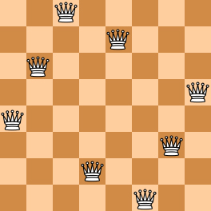
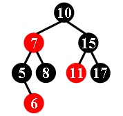
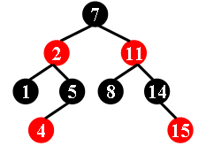

# PAT(121~180)

哈希：

[121哈希set查找排序](##1121 Damn Single(25))	[124set字典插入](##1124 Raffle for Weibo Followers(20))

图：

[122环、图的遍历](##1122 Hamiltonian Cycle(20))

贪心：

[125贪心绳长度](##1125 Chain the Ropes(25))

图：

[126DFS判断连通](##1126 Eulerian Path(25))

树：

[127建树、BFS层序遍历](##1127 ZigZagging on a Tree(30))	[130中序遍历、特殊输出](##1130 Infix Expression(25))	[135前序建二叉搜索平衡](##1135 Is It A Red-Black Tree(30))

数学：

[128n皇后问题set](##1128 N Queens Puzzle(20))

链表：

[133链表+排序](##1133 Splitting A Linked List(25))

## 121~135

### 1121 Damn Single(25)

"Damn Single (单身狗)" is the Chinese nickname for someone who is being single. You are supposed to find those who are alone in a big party, so they can be taken care of.

题意：给出N对情侣，我们需要在M人中找到多少个是单着来派对的。没有情侣的或有情侣但是只有一个人来的都算。

```text
input:	3
		11111 22222
		33333 44444
		55555 66666
		7
		55555 44444 10000 88888 22222 11111 23333
output:	5
		10000 23333 44444 55555 88888
```

范围：N (≤ 50,000)，M (≤ 10,000)，ID's which are 5-digit numbers (i.e. from 00000 to 99999)

思路：将伴侣放入哈希数组中，所有到来的顾客依次放入set中，若放入的同时，发现他已经有伴侣且伴侣已经在派对中了，则俩个人一起走。set会自动排序，按顺序输出即可。**注意五位数字要补零。**

```c++
#include<iostream>
#include<set>
#include<cstdio>
using namespace std;
int couple[100000];
set<int>party;
int main() {
    int n;
    cin >> n;
    for (int i = 0; i < 100000; i++)couple[i] = -1;
    for (int i = 0; i < n; i++) {
        int a, b; cin >> a >> b;
        couple[a] = b;
        couple[b] = a;
    }
    cin >> n;
    while (n--) {
        int i; cin >> i;
        if (couple[i] != -1 && party.count(couple[i])) {
            party.erase(couple[i]);
            continue;
        }
        party.insert(i);
    }
    cout << party.size() << endl;
    for (set<int>::iterator it = party.begin(); it != party.end(); it++) {
        if (it != party.begin())cout << ' ';
            printf("%05d",*it);
    }
}
```

### 1122 Hamiltonian Cycle(20)

The "Hamilton cycle problem" is to find a simple cycle that contains every vertex in a graph. Such a cycle is called a "Hamiltonian cycle".

In this problem, you are supposed to tell if a given cycle is a Hamiltonian cycle.

题意：H环包含图中所有元素，且不重复，要判断给出的路径是否可以构成这样的一个环。

```text
input:	6 10
		6 2
		3 4
		1 5
		2 5
		3 1
		4 1
		1 6
		6 3
		1 2
		4 5
		6
		7 5 1 4 3 6 2 5
		6 5 1 4 3 6 2
		9 6 2 1 6 3 4 5 2 6
		4 1 2 5 1
		7 6 1 3 4 5 2 6
		7 6 1 2 5 4 3 1
output:	YES
		NO
		NO
		NO
		YES
		NO
```

范围：*N* (2<*N*≤200)

思路：由这个环的性质可以得知，环的元素个数为图中元素个数+1，首位相等且过程中的元素不重复(unordered_set)，我们接下俩要判断的就是每一步之间是否可以接上，使用邻接矩阵去判断即可。

```c++
#include<iostream>
#include<vector>
#include<unordered_set>
using namespace std;
int connected[300][300] = { 0 };
unordered_set<int>s,temp;
int main() {
	int N, M, K;
	cin >> N >> M;
	for (int i = 1; i <= N; i++)s.insert(i);
	for (int i = 0; i < M; i++) {
		int a, b;
		cin >> a >> b;
		connected[a][b] = connected[b][a] = 1;
	}
	cin >> K;
	while (K--) {
		temp = s;
		int n;
		cin >> n;
		int path[n];
		int flag = 1;
		for (int i = 0; i < n; i++) {
			cin >> path[i];
		}
		if (n != N + 1 || path[0] != path[n - 1]) {
			flag = 0;
		}
		else {
			for (int i = 0; i < n - 1; i++) {
				if (temp.count(path[i])) {
					temp.erase(path[i]);
				}
				else {
					flag = 0;
					break;
				}
				if (!connected[path[i]][path[i + 1]]) {
					flag = 0;
				}
			}
		}
		if (flag == 0)cout << "NO\n";
		else cout << "YES\n";
	}
}
```

### 1123 Is It a Complete AVL Tree(30)

An AVL tree is a self-balancing binary search tree. In an AVL tree, the heights of the two child subtrees of any node differ by at most one; if at any time they differ by more than one, rebalancing is done to restore this property. Figures 1-4 illustrate the rotation rules.


Now given a sequence of insertions, you are supposed to output the level-order traversal sequence of the resulting AVL tree, and to tell if it is a complete binary tree.

题意：

```text
input:
output:
```

范围：

思路：

```c++

```


### 1124 Raffle for Weibo Followers(20)

John got a full mark on PAT. He was so happy that he decided to hold a raffle（抽奖） for his followers on Weibo -- that is, he would select winners from every N followers who forwarded his post, and give away gifts. Now you are supposed to help him generate the list of winners.

题意：微博抽奖，从M条记录中抽奖，记录为抽奖人的id，一个人可以多次参与，但是一个人只能中奖一次，给出第一个中奖者的下标(1开始)和中奖间隔，打印出所有中奖者，没有中奖者时打印`Keep going...`。

```text
input:	9 3 2
		Imgonnawin!
		PickMe
		PickMeMeMeee
		LookHere
		Imgonnawin!
		TryAgainAgain
		TryAgainAgain
		Imgonnawin!
		TryAgainAgain
output:	PickMe
		Imgonnawin!
		TryAgainAgain
```

范围： M (≤ 1000)

思路：使用set来做字典，将中奖者放入字典中。下标随着每次输入来变化，当有人重复中奖时，直接舍弃这条记录，下标不变，接收下一条记录。

```c++
#include<iostream>
#include<set>
using namespace std;
int M, N, S;
set<string>dic;
int main() {
	cin >> M >> N >> S;
	int index = 0;
	while (M--) {
		string s;
		cin >> s;
		if (dic.count(s))continue;
		index++;
		if (index >= S && (index - S) % N == 0) {
			dic.insert(s);
			cout << s << endl;
		}
	}
	if (index < S)cout << "Keep going...\n";
}
```

### 1125 Chain the Ropes(25)

Given some segments of rope, you are supposed to chain them into one rope. Each time you may only fold two segments into loops and chain them into one piece, as shown by the figure. The resulting chain will be treated as another segment of rope and can be folded again. After each chaining, the lengths of the original two segments will be halved.

Your job is to make the longest possible rope out of *N* given segments.

题意：绳结，两条绳子可以组成一条新的绳子，组成之后的长度为两条绳子之和的一半，现给出一组绳子的长度，要求最终绳子长度的最大值。

```text
input:
output:
```

范围：

思路：注意理解题意，每次结绳长度都会减半，组成的绳子会变成一条新的绳子，下次结绳仍然需要长度减半。也就是说越前面结的绳子长度会被折损得越多次，故我们将绳子从小到大排序，先让小的绳子结成一对，最后跟最长得绳子结即可。

```c++
#include<iostream>
#include<algorithm>
using namespace std;
int len[10001];
int main() {
	int n; cin >> n;
	for (int i = 0; i < n; i++)cin >> len[i];
	sort(len, len + n);
	int ans = len[0];
	for (int i = 1; i < n; i++) {
		ans = (ans + len[i]) / 2;
	}
	cout << ans;
}
```

### 1126 Eulerian Path(25)

In graph theory, an Eulerian path is a path in a graph which visits every edge exactly once. Similarly, an Eulerian circuit is an Eulerian path which starts and ends on the same vertex. They were first discussed by Leonhard Euler while solving the famous Seven Bridges of Konigsberg problem in 1736. It has been proven that connected graphs with all vertices of even degree have an Eulerian circuit, and such graphs are called **Eulerian**. If there are exactly two vertices of odd degree, all Eulerian paths start at one of them and end at the other. A graph that has an Eulerian path but not an Eulerian circuit is called **semi-Eulerian**. (Cited from https://en.wikipedia.org/wiki/Eulerian_path)

Given an undirected graph, you are supposed to tell if it is Eulerian, semi-Eulerian, or non-Eulerian.

题意：题目给出了两种图的类型，需要我们对给出图的类型进行判断，我们只需要按照上面的判断条件进行判断并输出即可。

```text
input:	7 12
		5 7
		1 2
		1 3
		2 3
		2 4
		3 4
		5 2
		7 6
		6 3
		4 5
		6 4
		5 6
output:	2 4 4 4 4 4 2
		Eulerian
```

范围：N (≤ 500)

思路：输入邻接矩阵，将每个节点的度统计出来，按照题目信息进行类型判断即可。当然，**如果是非连通图则不能进行判断(5分)**，输出`non-Eulerian`。

```c++
#include<iostream>
#include<vector>
using namespace std;
int N, M;
vector<int>v[501];
int num[501] = { 0 };
bool visited[501] = { 0 };
void dfs(int cur) {
	visited[cur] = 1;
	for (int i : v[cur]) {
		if (!visited[i])dfs(i);
	}
}
int main() {
	cin >> N >> M;
	while (M--) {
		int a, b; cin >> a >> b;
		v[a].push_back(b);
		v[b].push_back(a);
	}
	for (int i = 1; i <= N; i++) {
		num[i] = v[i].size();
		if (i != 1)cout << ' ';
		cout << num[i];
	}
	cout << endl;
	int num_of_g = 0;
	for (int i = 1; i <= N; i++) {
		if (!visited[i]) {
			dfs(i);
			num_of_g++;
		}
	}
	if (num_of_g == 1) {//连通图判断
		int num_of_odd = 0;
		for (int i = 1; i <= N; i++) {
			if (num[i] % 2) { num_of_odd++; }
		}
		if (num_of_odd == 0)cout << "Eulerian\n";
		else if (num_of_odd == 2)cout << "Semi-Eulerian\n";
		else cout << "Non-Eulerian\n";
		return 0;
	}
	cout << "Non-Eulerian\n";
}
```

### 1127 ZigZagging on a Tree(30)

Suppose that all the keys in a binary tree are distinct positive integers.  A unique binary tree can be determined by a given pair of postorder and inorder traversal sequences.  And it is a simple standard routine to print the numbers in level-order.  However, if you think the problem is too simple, then you are too naive.  This time you are supposed to print the numbers in "zigzagging order" -- that is, starting from the root, print the numbers level-by-level, alternating between left to right and right to left.  For example, for the following tree you must output: 1 11 5 8 17 12 20 15.


题意：给出inorder和postorder，按照题目要求进行扫描输出。

```text
input:	8
		12 11 20 17 1 15 8 5
		12 20 17 11 15 8 5 1
output:	1 11 5 8 17 12 20 15
```

范围：N (≤30)

思路：可以看出Z字扫描也就是在层序遍历的过程中，每两行给他反过来输出。我们先由后序和中序还原树，将正常层序遍历扫出来，同时统计每一层的数量，根据这个数量信息，将层序遍历中间元素进行相应反转，最后输出。

注意在反转过程中，每一层都要扫到，边界条件要写清楚(**=没写，即最后一层没扫描到，扣14分**)

```c++
#include<iostream>
#include<queue>
#include<vector>
#include<algorithm>
using namespace std;
struct Node {
	int val, level = 0;
	Node* left, * right;
	Node(int v) :val(v), left(NULL), right(NULL) {}
	Node() :val(), left(NULL), right(NULL) {}
}node[30];
int inorder[30], postorder[30];
int ans[30];
int each_level_num[30] = { 0 };
Node* create(int postL, int postR, int inL, int inR) {
	if (postL > postR)return NULL;
	Node* root = new Node(postorder[postR]);
	int k;
	for (k = inL; inorder[k] != root->val; k++);
	int leftnum = k - inL;
	root->left = create(postL, postL + leftnum - 1, inL, k - 1);
	root->right = create(postL + leftnum, postR - 1, k + 1, inR);
	return root;
}
int main() {
	int n; cin >> n;
	for (int i = 0; i < n; i++)cin >> inorder[i];
	for (int i = 0; i < n; i++)cin >> postorder[i];
	Node* root = create(0, n - 1, 0, n - 1);
	queue<Node*>q;
	q.push(root);
	int k = 1, max_level = 0, cur = 0;
	while (!q.empty()) {
		Node* now = q.front();
		q.pop();
		ans[cur++] = now->val;
		each_level_num[now->level]++;
		if (max_level < now->level)max_level = now->level;
		if (now->left) { q.push(now->left); now->left->level = now->level + 1; }
		if (now->right) { q.push(now->right); now->right->level = now->level + 1; }
	}
	for (int i = 0,sum=0; i <= max_level; sum+=each_level_num[i], i++) {
		if (i % 2==0) {
			reverse(ans + sum, ans + (sum + each_level_num[i]));
		}
	}
	for(int i=0;i<n;i++){
		if (i)cout << ' ';
		cout << ans[i];
	}
	cout<<endl;
}
```

### 1128 N Queens Puzzle(20)

The "eight queens puzzle" is the problem of placing eight chess queens on an 8×8 chessboard so that no two queens threaten each other. Thus, a solution requires that no two queens share the same row, column, or diagonal. The eight queens puzzle is an example of the more general *N* queens problem of placing *N* non-attacking queens on an *N*×*N*  chessboard. (From Wikipedia - "Eight queens puzzle".)

Here you are NOT asked to solve the puzzles. Instead, you are supposed to judge whether or not a given configuration of the chessboard is a solution. To simplify the representation of a chessboard, let us assume that no two queens will be placed in the same column. Then a configuration can be represented by a simple integer sequence (*Q*1,*Q*2,⋯,*Q**N*), where *Q**i* is the row number of the queen in the *i*-th column. For example, Figure 1 can be represented by (4, 6, 8, 2, 7, 1, 3, 5) and it is indeed a solution to the 8 queens puzzle; while Figure 2 can be represented by (4, 6, 7, 2, 8, 1, 9, 5, 3) and is NOT a 9 queens' solution.




题意：n皇后问题，在n×n棋盘上，有n个皇后，两两之间不能相同横竖正斜反斜。判断给出的棋盘是否符合。

```text
input:	4
		8 4 6 8 2 7 1 3 5
		9 4 6 7 2 8 1 9 5 3
		6 1 5 2 6 4 3
		5 1 3 5 2 4
output:	YES
		NO
		NO
		YES
```

范围： *K* (1<*K*≤200)，all *i*=1,⋯,*N*

思路：n皇后问题，现在给出的样例都是按照X=1到X=n的棋子的Y值，故不存在两个皇后在同一个X上。我们只需要判断是否在同一个Y上，或者同一斜线（45°/135°）上，我们使用三个set（Y/sum/diff）分别来统计。sum表示x+y的值，diff表示x-y（y-x也行），Y表示不同的y值。也就是说只有当y、x+y和x-y者三条直线没有重复出现过时，才会通过。

```c++
#include<iostream>
#include<set>
using namespace std;
int a[1000];
int n;
bool isValid() {
	set<int>y, sum, diff;
	for (int i = 0; i < n; i++) {
        //.first为迭代器；.second为插入是否成功
		if (!y.insert(a[i]).second)return false;
		if (!sum.insert(i + a[i]).second)return false;
		if (!diff.insert(i - a[i]).second)return false;
	}
	return true;
}
int main() {
	int k; cin >> k;
	while (k--) {
		cin >> n;
		for (int i = 0; i < n; i++)cin >> a[i];
		if (isValid())cout << "YES\n";
		else cout << "NO\n";
	}
}
```

### 1129 Recommendation System(25)

Recommendation system predicts the preference that a user would give to an item. Now you are asked to program a very simple recommendation system that rates the user's preference by the number of times that an item has been accessed by this user.

题意：推荐系统，当用户输入一个请求时，将其过去请求频率最高的k个请求返回。第一个请求不需要返回，因为此时无法进行推荐。

```text
input:	12 3
		3 5 7 5 5 3 2 1 8 3 8 12
output:	5: 3
		7: 3 5
		5: 3 5 7
		5: 5 3 7
		3: 5 3 7
		2: 5 3 7
		1: 5 3 2
		8: 5 3 1
		3: 5 3 1
		8: 3 5 1
		12: 3 5 8
```

范围：N (≤ 50,000)，K (≤ 10)

思路：

```c++

```

### 1130 Infix Expression(25)

Given a syntax tree (binary), you are supposed to output the corresponding infix expression, with parentheses reflecting the precedences of the operators.

题意：由题目可以看出这是一个中序遍历。

```text
input:	8
		* 8 7
		a -1 -1
		* 4 1
		+ 2 5
		b -1 -1
		d -1 -1
		- -1 6
		c -1 -1
output:	(a+b)*(c*(-d))
```

范围：N (≤ 20)

思路：建树其实可以简化，用数组下标表示地址即可。重点在于对输出括号时机的判断。左括号在进入左节点之前，右括号在进入右节点之后，而且在其不为根节点、叶子节点时输出。

```c++
#include<iostream>
#include<vector>
using namespace std;
struct Node {
	string data;
	Node* left, * right;
}node[21];
Node* p;
void inOrder(Node* root) {
	if (root == NULL)  return;
	if(root!=p&&(root->left||root->right))cout<<'(';
	inOrder(root->left);
	cout << root->data;
	inOrder(root->right);
	if (root != p && (root->left || root->right))cout << ')';
}
int main() {
	int n;
	cin >> n;
	for (int i = 1; i <= n; i++) {
		int a, b;
		cin >> node[i].data >> a >> b;
		if (a != -1)node[i].left = &node[a];
		if (b != -1)node[i].right = &node[b];
	}
	Node* root = &node[1];
	for (int i = 1; i <= n; i++) {
		Node* p = &node[i];
		if (p->left == root || p->right == root) {
			root = p;
			i = 1;
		}
	}//找到根节点
	p = root;
	inOrder(root);
}
```

### 1131 Subway Map(30)

In the big cities, the subway systems always look so complex to the visitors. To give you some sense, the following figure shows the map of Beijing subway. Now you are supposed to help people with your computer skills! Given the starting position of your user, your task is to find the quickest way to his/her destination.

题意：给一张地铁地图，找出最快到达的路径。

```text
input:	4
		7 1001 3212 1003 1204 1005 1306 7797
		9 9988 2333 1204 2006 2005 2004 2003 2302 2001
		13 3011 3812 3013 3001 1306 3003 2333 3066 3212 3008 2302 3010 3011
		4 6666 8432 4011 1306
		3
		3011 3013
		6666 2001
		2004 3001
output:	2
		Take Line#3 from 3011 to 3013.
		10
		Take Line#4 from 6666 to 1306.
		Take Line#3 from 1306 to 2302.
		Take Line#2 from 2302 to 2001.
		6
		Take Line#2 from 2004 to 1204.
		Take Line#1 from 1204 to 1306.
		Take Line#3 from 1306 to 3001.
```

范围：*N* (≤ 100)

思路：

```c++

```

### 1133 Splitting A Linked List(25)

Given a singly linked list, you are supposed to rearrange its elements so that all the negative values appear before all of the non-negatives, and all the values in [0, K] appear before all those greater than K. The order of the elements inside each class must not be changed. For example, given the list being 18→7→-4→0→5→-6→10→11→-2 and K being 10, you must output -4→-6→-2→7→0→5→10→18→11.

题意：将一个链表分成三个桶，桶1放小于0的数，桶2放不大于k的数，桶3放大于k的数。按照桶的顺序加元素出现的顺序进行输出。

```text
input:	00100 9 10
		23333 10 27777
		00000 0 99999
		00100 18 12309
		68237 -6 23333
		33218 -4 00000
		48652 -2 -1
		99999 5 68237
		27777 11 48652
		12309 7 33218
output:	33218 -4 68237
		68237 -6 48652
		48652 -2 12309
		12309 7 00000
		00000 0 99999
		99999 5 23333
		23333 10 00100
		00100 18 27777
		27777 11 -1
```

范围：N (≤105) K (≤103).

思路：排序题，将各种信息都填入结构体中，最后进行排序输出即可。old_idx为了按照出现顺序排序。

```c++
#include<iostream>
#include<algorithm>
#include<vector>
using namespace std;

int start, n, k;
struct Node {
	int val;
	int old_idx, next;
	int rank;
}node[100000];
bool cmp(int x, int y) {
	if (node[x].rank != node[y].rank)return node[x].rank < node[y].rank;
	else return node[x].old_idx < node[y].old_idx;
}
int main() {
	cin >> start >> n >> k;
	while (n--) {
		int a, b, c;
		cin >> a >> b >> c;
		node[a].val = b;
		node[a].next = c;
		if (b < 0)node[a].rank = 0;
		else if (b <= k)node[a].rank = 1;
		else node[a].rank = 2;
	}
	vector<int>ans;//存放地址
	int j = 0;
	for (int i = start; i != -1; i = node[i].next) {
		node[i].old_idx = j++;
		ans.push_back(i);
	}
	sort(ans.begin(), ans.end(), cmp);
	for (int i = 0; i < ans.size(); i++) {
		if (i == 0)printf("%05d %d ", ans[i], node[ans[i]].val);
		else {
			printf("%05d\n%05d %d ", ans[i], ans[i], node[ans[i]].val);
		}
	}
	cout << "-1";
}
```

### 1135 Is It A Red-Black Tree(30)

There is a kind of balanced binary search tree named **red-black tree** in the data structure. It has the following 5 properties:

- (1) Every node is either red or black.
- (2) The root is black.（根是黑色的）
- (3) Every leaf (NULL) is black.
- (4) If a node is red, then both its children are black.（红色节点的孩子是黑色的）
- (5) For each node, all simple paths from the node to descendant leaves contain the same number of black nodes.（一个节点的左右子树的黑色节点数相等）

For example, the tree in Figure 1 is a red-black tree, while the ones in Figure 2 and 3 are not.






题意：红黑树的定义如上文，现在给出前序遍历，我们要输出判断这棵树是否为红黑树

```text
input:	3
		9
		7 -2 1 5 -4 -11 8 14 -15
		9
		11 -2 1 -7 5 -4 8 14 -15
		8
		10 -7 5 -6 8 15 -11 17
output:	Yes
		No
		No
```

范围：K (≤30) N (≤30)

思路：首先把树建好，题目说是一种平衡二叉搜索树，故可以直接通过前序序列建立，<u>根节点</u>是第一个，右子树的根节点是比<u>根节点</u>大的节点，此节点往左是<u>根节点</u>的左子树，以此不断遍历即可生成红黑树。在生成过程中，可以根据其正负，将其红黑属性填上。

其次，根据题目给出的五条性质逐一排除，遇到不符合的就返回false。主要就是2、4、5条。4和5都可以用bfs来做。

```c++
#include<iostream>
#include<queue>
#include<cmath>
using namespace std;
#define RED 0
#define BLACK 1
int n, arr[35];
struct Node {
	int data, tag;
	Node* left, * right;
}node[35];
Node* create(int l, int r) {
	if (l > r)return NULL;
	Node* root = new Node;
	root->data = arr[l];
	root->tag = arr[l] > 0 ? BLACK : RED;
	int k;
	for (k = l + 1; k < r && (abs)(arr[k]) < (abs)(arr[l]); k++);
	root->left = create(l + 1, k -1);
	root->right = create(k, r);
	return root;
}
int num_of_black(Node* root) {
	if (root == NULL)return 0;
	if (root->tag == BLACK) {
		return max(num_of_black(root->left), num_of_black(root->right)) + 1;
	}
	else return max(num_of_black(root->left), num_of_black(root->right));
}
bool isValid(Node* root) {
	if (root->tag == RED)return false;//2
	{//4
		queue<Node*>q;
		q.push(root);
		while (!q.empty()) {
			Node* now = q.front();
			q.pop();
			if (now->left) {
				if (now->tag == RED && now->left->tag == RED)return false;
				q.push(now->left);
			}
			if (now->right) {
				if (now->tag == RED && now->right->tag == RED)return false;
				q.push(now->right);
			}
		}
	}
	{//5
		queue<Node*>q;
		q.push(root);
		while (!q.empty()) {
			Node* now = q.front();
			q.pop();
			if (num_of_black(now->left) != num_of_black(now->right))return false;
			if (now->left) {
				q.push(now->left);
			}
			if (now->right) {
				q.push(now->right);
			}
		}
	}
	return true;
}
int main() {
	int k;
	cin >> k;
	while (k--) {
		cin >> n;
		for (int i = 0; i < n; i++)cin >> arr[i];
		Node* root = create(0, n - 1);
		if (isValid(root)) {
			cout << "Yes\n";
		}
		else cout << "No\n";
	}
}
```


题意：

```text
input:
output:
```

范围：

思路：

```c++

```


## 136~150

## 151~165

## 166~180


