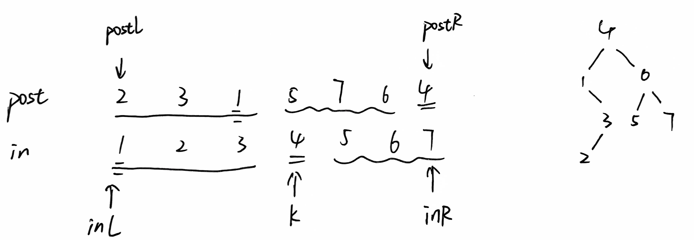

# PAT(1~60)

基本操作：

[1数字处理vector](##1001 A+B Format(20))	[2数组遍历](##1002 A+B for Polynomials(25))	[5字符操作](##1005 Spell It Right(20))	[6字符串处理排序](##1006 Sign In and Sign Out(25))	[8简单加法](##1008 Elevator(20))

[9多项式相乘](##1009 Product of Polynomials(25))	[11简单比较大小](##1011 World Cup Betting(20))	

最短路径：

[3图最短+附加最大DFS](##1003 Emergency(25))	[4树遍历层数DFS](##1004 Counting Leaves(30))	[13DFS求连通子图数](##1013 Battle Over Cities(25))	[18DFS最短路径+附加条件](##1018 Public Bike Management(30))	[30DFS最短路径+最少开销](##1030 Travel Plan(30))

动态规划：

[7最大和连续子序列](##1007 Maximum Subsequence Sum(25))

数学：

[10进制转换](##1010 Radix(25))	[15进制、质数](##1015 Reversible Primes(20))	[19回文数、进制](##1019 General Palindromic Number(20))	[24字符串相加回文](##1024 Palindromic Number(20))	[27进制转换](##1027 Colors in Mars(20))

排序：

[12排序+排名](##1012 The Best Rank(25))	[16记录排序，计算费用](##1016 Phone Bills(25))	[25排序+排名](##1025 PAT Ranking(25))	[28简单排序](##1028 List Sorting(25))	[29简单排序](##1029 Median(25))

树的遍历：

[20中序+后序建树BFS层序](##1020 Tree Traversals(25))	[21DFS树的高度连通子图](##1021 Deepest Root(25))

哈希查找：

[22map索引值查找](##1022 Digital Library(30))	[23map映射次数](##1023 Have Fun with Numbers(20))

排队问题（※）：

[14窗口queue排队](##1014 Waiting in Line(30))	[17排队](##1017 Queueing at Bank(25))	[26排队](##1026 Table Tennis(30))

## 1~15

### 1001 A+B Format(20)

Calculate *a*+*b* and output the sum in standard format -- that is, the digits must be separated into groups of three by commas (unless there are less than four digits).

题意：输入a和b，输出a+b的结果，并用逗号进行分隔成相应格式。

输入：-1000000 9

输出：-999,991

范围：−10^6≤ *a* , *b* ≤10^6；int就足够

思路：用vector把每一位都存起来，每三位中间存一个【，】，检查最后一位是否为【，】，是则pop_back，然后反过来输出。

```c++
#include<iostream>
#include<vector>
#include<algorithm>
using namespace std; 
int main(){
    int a,b;
    cin>>a>>b;
    a+=b;
    if(a<0){cout<<'-';a=-a;}
    else if(a==0){cout<<0;return 0;}
    vector<char>v;
    for(int i=1;a>0;a/=10,i++){
        v.push_back(a%10+'0');
        if(i%3==0)v.push_back(',');
    }
    if(v[v.size()-1]==',')v.pop_back();
    reverse(v.begin(),v.end());
    for(char c:v){
        cout<<c;
    }
    cout<<endl;
    return 0;
}
```

### 1002 A+B for Polynomials(25)

This time, you are supposed to find *A*+*B* where *A* and *B* are two polynomials.

题意：输出两个一元多项式的和

输入：2 1 2.4 0 3.2 2 2 1.5 1 0.5  

输出：3 2 1.5 1 2.9 0 3.2

范围： 1≤*K*≤10，0≤<*N*k<*N*2<*N*1≤1000.

思路：直接开一个数组，因为知道最高次数为1000，直接在这个数组上操作，最后输出即可。

```c++
#include<iostream>
#include<cstdio>
using namespace std;
double ans[1001]={0};
int main(){
    int n;cin>>n;
    int a;double b;
    while(n--){
        cin>>a>>b;
        ans[a]=b;
    }
    cin>>n;
    while(n--){
        cin>>a>>b;
        ans[a]+=b;
    }
    int max=0,num=0;
    for(int i=0;i<=1000;i++){
        if(ans[i]!=0){
            num++;
            if(max<i)max=i;
        }
    }
    cout<<num;
    for(int i=max;i>=0;i--){
        if(ans[i])
            printf(" %d %.1f",i,ans[i]);
    }
}
```

### 1003 Emergency(25)

As an emergency rescue team leader of a city, you are given a special map of your country. The map shows several scattered cities connected by some roads. Amount of rescue teams in each city and the length of each road between any pair of cities are marked on the map. When there is an emergency call to you from some other city, your job is to lead your men to the place as quickly as possible, and at the mean time, call up as many hands on the way as possible.

题意：给了每个城市的急救队的人手，和每个城市之间的距离，需要急救队从一个城市到另一个城市，走的距离最短且招到的人手要更多。

输入：N M C1 C2	+	numofteam	+	连通情况

5 6 0 2
1 2 1 5 3
0 1 1
0 2 2
0 3 1
1 2 1
2 4 1
3 4 1

输出：2 4

范围： *N* (≤500)

思路：典型的求最短路径，用DFS即可，注意：min_dis初始值设置不够大会不通过。

```c++
#include<iostream>
#include<vector>
using namespace std;
int n, m, c1, c2;
int num_of_team[500];
vector<int>v[500];
int dis[500][500];
int min_dis[500];
//城市编号从0开始
int path_num = 0, team_num = 0;
void DFS(int cur_city, int cur_dis, int cur_team) {
	if (cur_dis > min_dis[cur_city])return;
	if (cur_city == c2) {//到了
		if (cur_dis == min_dis[c2]) {//相同dis
			path_num++;
			if (cur_team > team_num)team_num = cur_team;
		}
		else {
			min_dis[c2] = cur_dis;
			path_num = 1;
			team_num = cur_team;
		}
	}
	else {//未到达
		if (min_dis[cur_city] > cur_dis)min_dis[cur_city] = cur_dis;
		for (int i : v[cur_city]) {
			DFS(i, cur_dis + dis[cur_city][i], cur_team + num_of_team[i]);
		}
	}
}

int main() {
	cin >> n >> m >> c1 >> c2;
	for (int i = 0; i < n; i++)cin >> num_of_team[i];
	while (m--) {
		int a, b, c;
		cin >> a >> b >> c;
		v[a].push_back(b);
		v[b].push_back(a);
		dis[a][b] = dis[b][a] = c;
	}//输入完毕
	for (int i = 0; i < n; i++)min_dis[i] = 0x3f3f;
	DFS(c1, 0, num_of_team[c1]);
	cout << path_num << ' ' << team_num;
}
```

### 1004 Counting Leaves(30)

A family hierarchy is usually presented by a pedigree tree.  Your job is to count those family members who have no child.

题意：族谱通常用树表示，统计数中无孩子节点的数量。

```
input：	N M	+	节点信息
		2 1
		01 1 02
output：0 1每一层的无孩节点的数目
```

范围：  0<*N*<100,*M* <*N*

思路：可以使用dfs进行遍历，带上level信息，到达叶子节点的时候进行记录，最后输出信息即可。

```c++
#include<iostream>
#include<vector>
using namespace std;
int n, m;
vector<int>v[100];
//id是两位构成的
int ans[100] = { 0 }, maxlevel = 0;
void DFS(int cur_node, int cur_level) {
    if (v[cur_node].empty()) {
        ans[cur_level]++;
        maxlevel = maxlevel > cur_level ? maxlevel : cur_level;
    }
    for (int i : v[cur_node]) {
        DFS(i, cur_level + 1);
    }
}
int main() {
    cin >> n >> m;
    while (m--) {
        int a, b, c;
        cin >> a >> b;
        while (b--) {
            cin >> c;
            v[a].push_back(c);
        }
    }
    DFS(1, 0);
    for (int i = 0; i <= maxlevel; i++) {
        if (i)cout << ' ';
        cout << ans[i];
    }
}
```

### 1005 Spell It Right(20)

Given a non-negative integer *N*, your task is to compute the sum of all the digits of *N*, and output every digit of the sum in English.

题意：输入一个整数，输出这个整数所有位的数字和，再用英文将这个数字进行输出

输入：12345

输出：one five

范围：*N* (≤10^100）

思路：用一个string来接收，用一个变量存储数字总和，最后按照数组输出即可。

```c++
#include<iostream>
#include<string>
using namespace std;
string c[10] = { "zero","one","two","three", "four", "five", "six", "seven", "eight", "nine" };
int main() {
	string s;
	cin >> s;
	long long j = 0;
	for (int i = 0; i < s.size(); i++)j += (s[i] - '0');
	string ans = to_string(j);
	for (int i = 0; i < ans.size(); i++) {
		if (i)cout << ' ';
		cout << c[ans[i] - '0'];
	}
}
```

### 1006 Sign In and Sign Out(25)

At the beginning of every day, the first person who signs in the computer room will unlock the door, and the last one who signs out will lock the door.  Given the records of signing in's and out's, you are supposed to find the ones who have unlocked and locked the door on that day.

题意：找出最早和最晚到达的人

```text
input:	3
		CS301111 15:30:28 17:00:10
		SC3021234 08:00:00 11:25:25
		CS301133 21:45:00 21:58:40
output:	SC3021234 CS301133
```

范围：  无

思路：输入时间字符串转换为分钟，进行排序，将最值进行输出即可

```c++
#include<iostream>
#include<cstdio>
#include<algorithm>
using namespace std;
struct stu{
	string id;
	int come_time,leave_time;
}s[1000];
bool cmp1(stu x, stu y) { return x.come_time < y.come_time; }
bool cmp2(stu x, stu y) { return x.leave_time > y.leave_time; }
int main() {
	int n; cin >> n;
	for (int i = 0; i < n; i++) {
		cin >> s[i].id;
		int a, b, c;
		scanf("%d:%d:%d", &a, &b, &c);
		s[i].come_time = a * 3600 + b * 60 + c;
		scanf("%d:%d:%d", &a, &b, &c);
		s[i].leave_time = a * 3600 + b * 60 + c;
	}
	sort(s, s + n, cmp1);
	cout << s[0].id << ' ';
	sort(s, s + n, cmp2);
	cout << s[0].id << endl;
}
```

### 1007 Maximum Subsequence Sum(25)

Given a sequence of *K* integers { *N*1, *N*2, ..., *N**K* }. A continuous subsequence is defined to be { *N**i*, *N**i*+1, ..., *N**j* } where 1≤*i*≤*j*≤*K*. The Maximum Subsequence is the continuous subsequence which has the largest sum of its elements. For example, given sequence { -2, 11, -4, 13, -5, -2 }, its maximum subsequence is { 11, -4, 13 } with the largest sum being 20.

Now you are supposed to find the largest sum, together with the first and the last numbers of the maximum subsequence. 

题意：找出一个数组的最大连续子串和并将最大和、字串的开头和结尾元素进行输出；都为负则输出0、开头元素、结尾元素。

```text
input:	10
		-10 1 2 3 4 -5 -23 3 7 -21
output:	10 1 4
```

范围：K<10000

思路：我们先将每一项的前n项和进行计算放在sum[]数组中，则第i项到第j项的和为sun[j]-sun[i]。将字串和转化为数组元素减法。不断以每一个元素为右值，看前面左值对应的元素和是否更大，更大则将答案进行保存，不是则更行左值。左值会不断更新而不受右值的变化而重新归0，因为左值到右值之间如果不是递增，则说明这中间存在下降区间，故将左值同步到现在的右值，再将右值继续往右移动。

```c++
//0	   1	  2		3	 4    5  	6	  7	   8	9 	  10
//0	   -10    1     2    3    4    -5    -23    3  	7    -21
//0	   -10    -9	-7	-4	  0    -5    -28   -25  -18   -39
#include<iostream>
using namespace std;
int n, arr[10001], sum[10001];
int main() {
	cin >> n;
	for (int i = 1; i <= n; i++)cin >> arr[i];
	sum[0] = 0;
	for (int i = 1; i <= n; i++)sum[i] = sum[i - 1] + arr[i];
	int left = 0, right, max = -1;
	int ans1=0, ans2=0;
	for (right = 1; right <= n; right++) {
		if (sum[right] - sum[left] > max) {
			max = sum[right] - sum[left];
			ans1 = arr[left+1]; ans2 = arr[right];
		}
		if (sum[left] > sum[right])left = right;
	}
	if (max<0)cout<<0<<' ' << arr[1] << ' ' << arr[n];
	else cout << max << ' ' << ans1 << ' ' << ans2;
}
```

### 1008 Elevator(20)

The highest building in our city has only one elevator. A request list is made up with *N* positive numbers. The numbers denote at which floors the elevator will stop, in specified order. It costs 6 seconds to move the elevator up one floor, and 4 seconds to move down one floor. The elevator will stay for 5 seconds at each stop.

For a given request list, you are to compute the total time spent to fulfill the requests on the list. The elevator is on the 0th floor at the beginning and does not have to return to the ground floor when the requests are fulfilled.

题意：电梯请求，上一层需要6秒，下一层需要4秒，每一层停5秒，求总秒数

```text
input:	3 2 3 1
output:	41
//12+5+6+5+8+5
```

范围：输入<100

思路：到达每一层都要加5秒，直接加上，上和下分情况在总时间上进行累加即可。

```c++
#include<iostream>
using namespace std;

int main(){
    int n,sum=0;cin>>n;
    sum+=n*5;
    int now=0;
    while(n--){
        int i;cin>>i;
        if(i-now>0)sum+=(i-now)*6;
        else sum+=(now-i)*4;
        now=i;
    }
    cout<<sum<<endl;
}
```

### 1009 Product of Polynomials(25)

This time, you are supposed to find *A*×*B* where *A* and *B* are two polynomials.

题意：计算两个一元多项式的乘法

```text
input:	2 1 2.4 0 3.2
		2 2 1.5 1 0.5
output:	3 3 3.6 2 6.0 1 1.6
```

范围：1≤*K*≤10, 0≤*N**K*<⋯<*N*2<*N*1≤1000.  

思路：用double数组存，下标表示指数，相乘就是指数相加，数字部分相乘，在保存到答案数组即可。注意两个式子相乘后答案的指数可能会破2000，建议开大一点。

```c++
#include<iostream>
#include<vector>
#include<cstdio>
using namespace std;
vector<int>v;
int main() {
	double arr[4000] = { 0 }, ans[4000] = { 0 };
	int n; cin >> n;
	int a; double b;
	while (n--) {
		cin >> a >> b;
		arr[a] = b;
	}
	cin >> n;
	int max = 0;
	while (n--) {
		cin >> a >> b;
		for (int i = 0; i < 2000; i++) {
			ans[i + a] += arr[i] * b;
			if (arr[i] * b != 0 && max < i + a)max = i + a;
		}
	}
	for (int i = max; i >= 0; i--) { if (ans[i] != 0)v.push_back(i); }
	cout << v.size();
	for (int i:v) {
		printf(" %d %.1f", i, ans[i]);
	}
    cout<<endl;
}
```

### 1010 Radix(25)

Given a pair of positive integers, for example, 6 and 110, can this equation 6 = 110 be true?  The answer is `yes`, if 6 is a decimal number and 110 is a binary number.

Now for any pair of positive integers *N*1 and *N*2, your task is to find the radix of one number while that of the other is given.

题意：进制转换，当tag=1时，看是否存在使N2与**N1在radix进制下**相等的进制

```text
input:6 110 1 10
//N1 N2 tag radix
output:2
```

范围：radix{ 0-9, `a`-`z` } ,`a`-`z` ->10-35，进制未说明范围，即可能非常大

思路：两个函数，将字符转换为数字，将字符串+进制转换为10进制数，分别将N1和N2转换为十进制数，看是否相等。**差两个样例数值过大，若直接用最大值2147483647则会运行超时，使用二分法当数值小时也会超时，得不断优化，故未取得这2分，不值得尝试。**

```c++
#include<iostream>
#include<string>
#include<algorithm>
using namespace std;
int trans(char c) {
	if (c >= '0' && c <= '9')return c - '0';
	else return c - 'a' + 10;
}
long long trans_to_decimal(string s, int radix) {
	reverse(s.begin(),s.end());
	long long ans = 0;
	for (int i = 0, j = 1; i < s.size(); i++, j *= radix) {
		long long num=trans(s[i]);
		if (num > radix)return -1;
		ans += num * j;
	}
	return ans;
}
int main() {
	string N1, N2;
	int tag; int radix;
	cin >> N1 >> N2 >> tag >> radix;
	if (tag!=1) {
		string temp; temp = N1; N1 = N2; N2 = temp;
	}//永远都是N1固定,N2去找相应进制
	long long a1 = trans_to_decimal(N1, radix);
	long long i; char maxdigit = N2[0];
	for (i = 1; i < N2.size(); i++) {
		if (N2[i] > N2[i - 1])maxdigit = N2[i];
	}
	for (i=trans(maxdigit)+1; i<10000000; i++) {
		long long tt = trans_to_decimal(N2, i);
		if (tt == -1)continue;
		else if (tt == a1) {
			cout << i; return 0;
		}
	}
	cout << "Impossible";
}
```

### 1011 World Cup Betting(20)

With the 2010 FIFA World Cup running, football fans the world over were becoming increasingly excited as the best players from the best teams doing battles for the World Cup trophy in South Africa. Similarly, football betting fans were putting their money where their mouths were, by laying all manner of World Cup bets.

Chinese Football Lottery provided a "Triple Winning" game. The rule of winning was simple: first select any three of the games. Then for each selected game, bet on one of the three possible results -- namely `W` for win, `T` for tie, and `L` for lose. There was an odd assigned to each result. The winner's odd would be the product of the three odds times 65%.

For example, 3 games' odds are given as the following:

```
 W    T    L
1.1  2.5  1.7
1.2  3.1  1.6
4.1  1.2  1.1
```

To obtain the maximum profit, one must buy `W` for the 3rd game, `T` for the 2nd game, and `T` for the 1st game. If each bet takes 2 yuans, then the maximum profit would be (4.1×3.1×2.5×65%−1)×2=39.31 yuans (accurate up to 2 decimal places).

题意：一场比赛有三种结局，三场比赛分别输出数值最高的那一种结局，并将数值进行累乘和数值计算，得出最终结果并输出。简单。

```text
input:	1.1 2.5 1.7
		1.2 3.1 1.6
		4.1 1.2 1.1
output:	T T W 39.31
```

范围：无

思路：比较每一局中那个最大，输出相应字母，将ans进行累乘，最后输出

```c++
#include<iostream>
#include<cstdio>
using namespace std;

int main() {
	double a, b, c, ans = 0;
	for (int i = 0; i < 3; i++) {
		cin >> a >> b >> c;
		if (i)cout << ' ';
		if (a > b && a > c) {
			cout << 'W';
			ans = !ans ? a : ans * a;
		}
		if (b > a && b > c) {
			cout << 'T';
			ans = !ans ? b : ans * b;
		}
		if (c > a && c > b) {
			cout << 'L';
			ans = !ans ? c : ans * c;
		}
	}
	printf(" %.2f", (ans*0.65-1)*2);

}
```


### 1012 The Best Rank(25)

To evaluate the performance of our first year CS majored students, we consider their grades of three courses only: `C` - C Programming Language, `M` - Mathematics (Calculus or Linear Algrbra), and `E` - English. At the mean time, we encourage students by emphasizing on their best ranks -- that is, among the four ranks with respect to the three courses and the average grade, we print the best rank for each student.

For example, The grades of `C`, `M`, `E` and `A` - Average of 4 students are given as the following:

```
StudentID  C  M  E  A
310101     98 85 88 90
310102     70 95 88 84
310103     82 87 94 88
310104     91 91 91 91
```

Then the best ranks for all the students are No.1 since the 1st one has done the best in C Programming Language, while the 2nd one in Mathematics, the 3rd one in English, and the last one in average.

题意：查询学生，输出学生排名最好的学科及其对应学科的排名，查询不到则输出N/A

```text
input:	5 6
		310101 98 85 88
		310102 70 95 88
		310103 82 87 94
		310104 91 91 91
		310105 85 90 90
		310101
		310102
		310103
		310104
		310105
		999999
output:	1 C
		1 M
		1 E
		1 A
		3 A
		N/A
```

范围：*M* (≤2000)

思路：此题主要在于排序，和排序后名次的处理，当分数相同时排名相等，不递增。

```c++
#include<iostream>
#include<algorithm>
using namespace std;

struct stu{
    string id;
    int score[4];
    int rank[4];
};
char course[4]={'A','C','M','E'};
bool comp1(stu s1,stu s2){
    return s1.score[0]>s2.score[0];
}
bool comp2(stu s1,stu s2){
    return s1.score[1]>s2.score[1];
}
bool comp3(stu s1,stu s2){
    return s1.score[2]>s2.score[2];
}
bool comp4(stu s1,stu s2){
    return s1.score[3]>s2.score[3];
}
int main(){
    int N,M,i,j,k;
    cin>>N>>M;
    stu s[2000];
    for(i=0;i<N;i++){
        cin>>s[i].id>>s[i].score[1]>>s[i].score[2]
            >>s[i].score[3];
        s[i].score[0]=(s[i].score[1]+s[i].score[2]
            +s[i].score[3])/3;
    }
    sort(s,s+N,comp1);
    for(i=0;i<N;i++){
        if(i==0)s[i].rank[0]=i+1;
        else {
            if(s[i].score[0]==s[i-1].score[0]){
                s[i].rank[0]=s[i-1].rank[0];
            }else
                s[i].rank[0]=i+1;
        }
    }
    sort(s,s+N,comp2);
    for(i=0;i<N;i++){
        if(i==0)s[i].rank[1]=i+1;
        else {
            if(s[i].score[1]==s[i-1].score[1]){
                s[i].rank[1]=s[i-1].rank[1];
            }else
                s[i].rank[1]=i+1;
        }
    }
    sort(s,s+N,comp3);
    for(i=0;i<N;i++){
        if(i==0)s[i].rank[2]=i+1;
        else {
            if(s[i].score[2]==s[i-1].score[2]){
                s[i].rank[2]=s[i-1].rank[2];
            }else
                s[i].rank[2]=i+1;
        }
    }
    sort(s,s+N,comp4);
    for(i=0;i<N;i++){
        if(i==0)s[i].rank[3]=i+1;
        else {
            if(s[i].score[3]==s[i-1].score[3]){
                s[i].rank[3]=s[i-1].rank[3];
            }else
                s[i].rank[3]=i+1;
        }
    }
    for(i=0;i<M;i++){
        string t;
        cin>>t;
        for(j =0 ;j<N;j++){
            if(s[j].id==t){
                int min_rank=5;
                int min_course;
                for(k=0;k<4;k++){
                    if(min_rank>s[j].rank[k]){
                        min_rank=s[j].rank[k];
                        min_course=k;
                    }
                }
                cout<<min_rank<<" "<<course[min_course]<<endl;
                break;
            }
        }
        if(j==N)cout<<"N/A"<<endl;
    }
}
```


### 1013 Battle Over Cities(25)

It is vitally important to have all the cities connected by highways in a war. If a city is occupied by the enemy, all the highways from/toward that city are closed. We must know immediately if we need to repair any other highways to keep the rest of the cities connected. Given the map of cities which have all the remaining highways marked, you are supposed to tell the number of highways need to be repaired, quickly.

For example, if we have 3 cities and 2 highways connecting *c**i**t**y*1-*c**i**t**y*2 and *c**i**t**y*1-*c**i**t**y*3. Then if *c**i**t**y*1 is occupied by the enemy, we must have 1 highway repaired, that is the highway *c**i**t**y*2-*c**i**t**y*3.

题意：城市之间有联通路，当一个城市被占领了，则相邻的路会被取消。现在给定一个地图，要我们看当某个城市被占领时，要将其他城市连通起来需要新修多少条路。

```text
input:	3 2 3
		1 2
		1 3
		1 2 3
output:	1
		0
		0
```

范围：*N* (<1000), *M* and *K*

思路：转化一下图的思想，其实就是求将query城市排除掉之后，还有多少个连通子图，需要多建的路就是连通子图数-1。连通子图数用dfs求即可。

```c++
#include<iostream>
#include<memory.h>
#include<vector>
using namespace std;
int n, m, k;
vector<int>v[1000];
bool visited[1000] = { 0 };
void dfs(int cur_node) {
	visited[cur_node] = 1;
	for (int i : v[cur_node]) {
		if (!visited[i])dfs(i);
	}
}
int main() {
	cin >> n >> m >> k;
	while (m--) {
		int a, b;
		cin >> a >> b;
		v[a].push_back(b);
		v[b].push_back(a);
	}
	while (k--) {
		memset(visited, 0, sizeof(visited));
		int a; cin >> a;
		visited[a] = 1;
		int num =0;
		for (int i = 1; i <= n; i++) {
			if (!visited[i])
			{
				dfs(i);
				num++;
			}
		}
		cout << num - 1 << endl;
	}
}
```

### 1014 Waiting in Line(30)

Suppose a bank has *N* windows open for service. There is a yellow line in front of the windows which devides the waiting area into two parts. The rules for the customers to wait in line are:

- The space inside the yellow line in front of each window is enough to contain a line with *M* customers. Hence when all the *N* lines are full, all the customers after (and including) the (*NM*+1)st one will have to wait in a line behind the yellow line.
- Each customer will choose the shortest line to wait in when crossing the yellow line. If there are two or more lines with the same length, the customer will always choose the window with the smallest number.
- *C**u**s**t**o**m**e**r**i* will take *T**i* minutes to have his/her transaction processed.
- The first *N* customers are assumed to be served at 8:00am.

Now given the processing time of each customer, you are supposed to tell the exact time at which a customer has his/her business done.

For example, suppose that a bank has 2 windows and each window may have 2 customers waiting inside the yellow line. There are 5 customers waiting with transactions taking 1, 2, 6, 4 and 3 minutes, respectively. At 08:00 in the morning, *c**u**s**t**o**m**e**r*1 is served at *w**in**d**o**w*1 while *c**u**s**t**o**m**e**r*2 is served at *w**in**d**o**w*2. *C**u**s**t**o**m**e**r*3 will wait in front of *w**in**d**o**w*1 and *c**u**s**t**o**m**e**r*4 will wait in front of *w**in**d**o**w*2. *C**u**s**t**o**m**e**r*5 will wait behind the yellow line.

At 08:01, *c**u**s**t**o**m**e**r*1 is done and *c**u**s**t**o**m**e**r*5 enters the line in front of *w**in**d**o**w*1 since that line seems shorter now. *C**u**s**t**o**m**e**r*2 will leave at 08:02, *c**u**s**t**o**m**e**r*4 at 08:06, *c**u**s**t**o**m**e**r*3 at 08:07, and finally *c**u**s**t**o**m**e**r*5 at 08:10.

题意：一个办事处有N个窗口，一个窗口可以排队M个人，总共有K个人来办事，按照序号顺序，一个人结束，另一个人会立刻接上，不设到达时间。有Q个请求，问第Qi个人办理完成的时间是几点。

```text
input:	2 2 7 5
		1 2 6 4 3 534 2
		3 4 5 6 7
output:	08:07
		08:06
		08:10
		17:00
		Sorry
```

范围：*N* (≤20, number of windows), *M* (≤10, the maximum capacity of each line inside the yellow line), *K* (≤1000, number of customers), and *Q* (≤1000, number of customer queries).

思路：排队问题，用送、迎、入的思路，模拟每一分钟的状态。在顾客开始办事时，用leave_time来记录每个顾客离开时间。若在17点前还未进入窗口的排队序列，那其leave_time将为0且不会更新，已入队的顾客最终输出leave_time即可。

```c++
#include<iostream>
#include<cstdio>
#include<queue>
using namespace std;
int N, M, K, Q;
struct customer {
	int process_time, leave_time = 0;
}c[1001];//序号从1~K
int main() {
	cin >> N >> M >> K >> Q;
	queue<int>q[N];//窗口用queue
	int i, j, k, cur = 1;
	for (i = 1; i <= K; i++) {
		cin >> c[i].process_time;
	}
	//开始模拟
	for (int Time = 480; Time < 1020; Time++) {
		//送，遍历窗口
		for (i = 0; i < N; i++) {
			if (q[i].size()) {
				k = q[i].front();
				if (c[k].leave_time == Time)q[i].pop();
			}
		}
		//迎，从窗口前的第一排开始
		for (j = 1; j <= M; j++) {
			for (i = 0; i < N; i++) {
				if (q[i].size() < j) {
					q[i].push(cur); cur++;//每位顾客
				}
			}
		}
		//入，遍历窗口
		for (i = 0; i < N; i++) {
			if (q[i].size()) {
				k = q[i].front();
				if (c[k].leave_time == 0)c[k].leave_time = Time + c[k].process_time;
			}
		}
	}
	while (Q--) {
		cin >> i;
		if (c[i].leave_time == 0)cout << "Sorry\n";
		else printf("%02d:%02d\n", c[i].leave_time / 60, c[i].leave_time % 60);
	}

}
```

### 1015 Reversible Primes(20)

A **reversible prime** in any number system is a prime whose "reverse" in that number system is also a prime. For example in the decimal system 73 is a reversible prime because its reverse 37 is also a prime.

Now given any two positive integers *N* (<105) and *D* (1<*D*≤10), you are supposed to tell if *N* is a reversible prime with radix *D*.

题意：将一个素数，按照其进制进行反转，若反转之后的十进制数也是质数则输出`Yes`，否则输出`No`。考察进制转换、质数判断。

```text
input:	73 10
		23 2
		23 10
		-2
output:	Yes
		Yes
		No
```

范围： *N* (<105) and *D* (1<*D*≤10)

思路：trans函数将n按照d进制进行转换并反转，而后返回其对应的十进制数。isPri函数用来判断是否为素数。

```c++
#include<iostream>
using namespace std;
bool isPri(int x) {
    if (x <= 1)return false;
    for (int i = 2; i * i <= x; i++)
        if (x % i == 0)return false;
    return true;
}
int trans(int n, int r) {//进制转换并反转，返回十进制
    string s = "";
    while(n) {
        s += (n % r) + '0';
        n /= r;
    }
    int sum = 0;
    for (int i = s.size() - 1,u=1; i >= 0; i--,u*=r) {
        sum += u * (s[i] - '0');
    }
    return sum;
}
int  main() {
    int n, d;
    do {
        cin >> n;
        if (n < 0)break;
        cin >> d;
        if (!isPri(n)) {
            cout << "No\n"; continue;
        }
        if (!isPri(trans(n, d))) {
            cout << "No\n"; continue;
        }
        cout << "Yes\n";
    } while (1);
}
```

## 16~30

### 1016 Phone Bills(25)

A long-distance telephone company charges its customers by the following rules:

Making a long-distance call costs a certain amount per minute, depending on the time of day when the call is made. When a customer starts connecting a long-distance call, the time will be recorded, and so will be the time when the customer hangs up the phone. Every calendar month, a bill is sent to the customer for each minute called (at a rate determined by the time of day). Your job is to prepare the bills for each month, given a set of phone call records.

题意：打长途电话费用根据小时的不同来收费，给出通话记录，列出每个人的通话费用清单。

```text
input:	10 10 10 10 10 10 20 20 20 15 15 15 15 15 15 15 20 30 20 15 15 10 10 10
		10
		CYLL 01:01:06:01 on-line
		CYLL 01:28:16:05 off-line
		CYJJ 01:01:07:00 off-line
		CYLL 01:01:08:03 off-line
		CYJJ 01:01:05:59 on-line
		aaa 01:01:01:03 on-line
		aaa 01:02:00:01 on-line
		CYLL 01:28:15:41 on-line
		aaa 01:05:02:24 on-line
		aaa 01:04:23:59 off-line
output:	CYJJ 01
		01:05:59 01:07:00 61 $12.10
		Total amount: $12.10
		CYLL 01
		01:06:01 01:08:03 122 $24.40
		28:15:41 28:16:05 24 $3.85
		Total amount: $28.25
		aaa 01
		02:00:01 04:23:59 4318 $638.80
		Total amount: $638.80
```

范围：*N* (≤1000)

思路：排序问题，将记录先按照id字典序排列，而后按照时间排序。根据状态将记录入vector中。最后计算时间和费用可以使用一个函数引用两个变量同时计算，节省时间，当然分开也是可以通过的

```c++
#include<iostream>
#include<vector>
#include<algorithm>
#include<cstdio>
using namespace std;
int price[24];
struct Note {
	string id, state;
	int month, day, hour, minute;
}note[1000];
vector<Note>v[1000];
bool cmp(Note x, Note y) {
	if (x.id != y.id)return x.id < y.id;
	else if (x.month != y.month)return x.month < y.month;
	else if (x.day != y.day)return x.day < y.day;
	else if (x.hour != y.hour)return x.hour < y.hour;
	else return x.minute < y.minute;
}
void cal(int d1, int h1, int m1, int d2, int h2, int m2,int &minute,double &sum) {//利用引用对时间和费用同时计算
	while (d1 < d2 || h1 < h2 || m1 < m2) {
		minute++;
		sum += price[h1];
		m1++;
		if (m1 >= 60) {
			m1 = 0;
			h1++;
			if (h1 >= 24) {
				h1 = 0;
				d1++;
			}
		}
	}
}
int main() {
	for (int i = 0; i < 24; i++) {
		cin >> price[i];
	}
	int n; cin >> n;
	for (int i = 0; i < n; i++) {
		cin >> note[i].id;
		scanf(" %d:%d:%d:%d ", &note[i].month, &note[i].day, &note[i].hour, &note[i].minute);
		cin >> note[i].state;
	}
	sort(note, note + n, cmp);
	int num = 0;
	for (int i = 0; i < n; i++) {
		if (i != 0 && note[i].id != v[num][0].id)num++;
		if (v[num].empty()||v[num][v[num].size()-1].state == "off-line") {
			if (note[i].state == "on-line") {
				v[num].push_back(note[i]); 
			}//当为空或者前一位已经匹配上时，此时为on的话
			continue;
		}
		//处于非空待匹配状态
		if (note[i].state == "on-line") {
			v[num].pop_back();
		}
		v[num].push_back(note[i]);
	}
	for (int i = 0; i <= num; i++) {
		cout << v[i][0].id;
		printf(" %02d\n", v[i][0].month);
		double total_money = 0;
        //此处有bug，当v[i].size()==1时，也会进行输出。建议换成下面的循环。
		for (int j = 0; j <= v[i].size() / 2; j+=2) {
			printf("%02d:%02d:%02d %02d:%02d:%02d ",
				v[i][j].day, v[i][j].hour, v[i][j].minute,
				v[i][j + 1].day, v[i][j + 1].hour, v[i][j + 1].minute);
			int minute = 0; double sum = 0;
			cal(v[i][j].day, v[i][j].hour, v[i][j].minute, v[i][j + 1].day, v[i][j + 1].hour, v[i][j + 1].minute, minute, sum);
			cout << minute << " $";
			printf("%.2f\n", sum / 100);
			total_money += sum;
		}
		cout << "Total amount: $";
		printf("%.2f\n", total_money/100);
	}
}
//循环重写
for (int i = 0; i < num; i++) {
		if (v[i].size() > 1) {
			cout << v[i][0].id;
			printf(" %02d\n", v[i][0].month);
		}
        else continue;//只有一个记录时跳过，不显示
		double total = 0;
		for (int j = 0; j < v[i].size() / 2; j++) {
			printf("%02d:%02d:%02d %02d:%02d:%02d ",
				v[i][2 * j].day, v[i][2 * j].hour, v[i][2 * j].minute,
				v[i][2 * j + 1].day, v[i][2 * j + 1].hour, v[i][2 * j + 1].minute);
			cout << cal_min(v[i][2 * j], v[i][2 * j + 1]) << " $";
			double sum = cal_fee(v[i][2 * j], v[i][2 * j + 1]);
			printf("%.2f\n",sum );
			total += sum;
		}
		printf("Total amount: $%.2f\n", total);
	}
```

### 1017 Queueing at Bank(25)

Suppose a bank has *K* windows open for service. There is a yellow line in front of the windows which devides the waiting area into two parts. All the customers have to wait in line behind the yellow line, until it is his/her turn to be served and there is a window available. **It is assumed that no window can be occupied by a single customer for more than 1 hour.**//此处案例中没有体现，没有判断也能过。

Now given the arriving time *T* and the processing time *P* of each customer, you are supposed to tell the average waiting time of all the customers.

题意：一个银行有K个窗口，窗口前不设队列，顾客到了有位置就可以到窗口办事，给出顾客到达时间和办事时间，求所有办上事的顾客平均等待时间。注意过程精确到秒，结果输出分钟。 

```text
input:	7 3
		07:55:00 16
		17:00:01 2
		07:59:59 15
		08:01:00 60
		08:00:00 30
		08:00:02 2
		08:03:00 10
output:	8.2
```

范围：*N* (≤104) - the total number of customers, and *K* (≤100) - the number of windows.

思路：排队问题，以送、迎、入来进行，由于窗口前不设队列，直接用int数组来表示第i个窗口目前正在服务的顾客序号即可，没有则为-1。模拟时间过程，若下一个顾客的到达时间已经超过了银行的服务时间，则所有服务上的顾客全部信息统计完毕，结束模拟输出即可。注意在所有顾客后添加一位到达时间为超出范围的顾客，当所有顾客都可以在规定时间到达时就可以一次作为结束的标志。

```c++
#include<iostream>
#include<cstdio>
#include<algorithm>
using namespace std;
int N, K;
struct customer {
	int come_time, process_time = 0, leave_time = 0;
}c[10001];
bool cmp(customer x, customer y) { return x.come_time < y.come_time; }
int main() {
	cin >> N >> K;
	int i, j, k;
	double sum = 0;
	int q[101]; for (i = 0; i < K; i++)q[i] = -1;
	int cur = 0;
	for (i = 0; i < N; i++) {
		char s; int hh, mm, ss, process_time;
		cin >> hh >> s >> mm >> s >> ss >> process_time;
		c[i].process_time = (process_time>=60?60:process_time)*60;
		c[i].come_time = hh * 3600 + mm * 60 + ss;
	}
	c[N].come_time = 99999;
	sort(c, c + N, cmp);
	for (int Time = 28800; c[cur].come_time<61200; Time++) {
		//送
		for (i = 0; i < K; i++) {
			if (q[i] >= 0) {
				k = q[i];
				if (c[k].leave_time == Time) {
					q[i] = -1;
				}
			}
		}
		//迎
		for (i = 0; i < K; i++) {
			if (q[i] == -1&&c[cur].come_time<=Time) {
				q[i] = cur; cur++;
			}
		}
		//入
		for (i = 0; i < K; i++) {
			if (q[i] >= 0) {
				k = q[i];
				if (c[k].leave_time == 0) {
					c[k].leave_time = Time + c[k].process_time;
					sum += Time - c[k].come_time;
				}
			}
		}
	}
	printf("%.1f", (sum / cur) / 60);

}
```


### 1018 Public Bike Management(30)

There is a public bike service in Hangzhou City which provides great convenience to the tourists from all over the world.  One may rent a bike at any station and return it to any other stations in the city.

The Public Bike Management Center (PBMC) keeps monitoring the real-time capacity of all the stations.  A station is said to be in **perfect** condition if it is exactly half-full.  If a station is full or empty, PBMC will collect or send bikes to adjust the condition of that station to perfect.  And more, all the stations on the way will be adjusted as well.


When a problem station is reported, PBMC will always choose the shortest path to reach that station.  If there are more than one shortest path, the one that requires the least number of bikes sent from PBMC will be chosen.

The above figure illustrates an example.  The stations are represented by vertices and the roads correspond to the edges.  The number on an edge is the time taken to reach one end station from another.  The number written inside a vertex *S* is the current number of bikes stored at *S*.  Given that the maximum capacity of each station is 10.  To solve the problem at *S*3, we have 2 different shortest paths:

1. PBMC -> *S*1 -> *S*3.  In this case, 4 bikes must be sent from PBMC, because we can collect 1 bike from *S*1 and then take 5 bikes to *S*3, so that both stations will be in perfect conditions.
2. PBMC -> *S*2 -> *S*3.  This path requires the same time as path 1, but only 3 bikes sent from PBMC and hence is the one that will be chosen.

题意：有一个问题车站没有自行车，要求从中心出发到达问题车站的最短路径，途经的车站会被调整(车辆数变成最大容量/2)，若最短路径不唯一，则输出从中心发出最少车辆的路径。也是一道求最短路径的题目，加上了携带车辆的条件。

```text
input:	10 3 3 5
//Cmax N Sp M	最大容量 车站数 问题车站 路径数
		6 7 0
//车站现有车辆数
		0 1 1
		0 2 1
		0 3 3
		1 3 1
		2 3 1
output:	3 0->2->3 0
//中心发出的车辆数	路径	带回中心的车辆数
```

范围：*C**ma**x* (≤100)，*N* (≤500)

思路：与以往DFS类似，此题需要将send和take数带上，在路径长度相同时进行比较。并且进入DFS时进行更新，注意：当携带数与车站原有数之和能够满足Cmax/2时，**发车数为之前的发车数，而不是为0！！**因为过去的车站如果需要send，这个总数是需要记录的。若不能满足，则take数会清零。

```c++
#include<iostream>
#include<vector>
using namespace std;
int Cmax, n, sp, m;
int num_of_bike[501];
int dis[501][501], min_dis[501], final_take, final_send;
vector<int>v[501], path,final_path;
void dfs(int cur_station, int cur_dis, int cur_send, int cur_take) {
	if (min_dis[cur_station] < cur_dis)return;
	path.push_back(cur_station);
	if (cur_station == sp) {
		if (min_dis[sp] > cur_dis||(min_dis[sp] == cur_dis&&final_send>cur_send)||
			(min_dis[sp] == cur_dis && final_send == cur_send&&final_take>cur_take)) {
			min_dis[sp] = cur_dis;
			final_path = path;
			final_take = cur_take;
			final_send = cur_send;
		}//更短或者相同长度下发车数量更少、带回车辆更少，需要更新路径
	}
	else {
		if (min_dis[cur_station] > cur_dis)min_dis[cur_station] = cur_dis;
		for (int i : v[cur_station]) {
			if (num_of_bike[i] + cur_take < Cmax / 2) {
				dfs(i, cur_dis + dis[cur_station][i], cur_send + Cmax / 2 - cur_take - num_of_bike[i], 0);
			}
			else {
				dfs(i, cur_dis + dis[cur_station][i], cur_send, cur_take + num_of_bike[i]- Cmax / 2 );
			}
		}
	}
	path.pop_back();
}
int main() {
	cin >> Cmax >> n >> sp >> m;
	for (int i = 1; i <= n; i++)cin >> num_of_bike[i];
	for (int i = 0; i < m; i++) {
		int a, b, c;
		cin >> a >> b >> c;
		v[a].push_back(b);
		v[b].push_back(a);
		dis[a][b] = dis[b][a] = c;
	}
	for (int i = 1; i <= n; i++)min_dis[i] = 0x3f3f3f3f;
	dfs(0, 0, 0, 0);
	cout << final_send << ' ';
	for (int i = 0; i < final_path.size(); i++) {
		if (i)cout << "->";
		cout << final_path[i];
	}
	cout << ' ' << final_take;
}
```

### 1019 General Palindromic Number(20)

A number that will be the same when it is written forwards or backwards is known as a **Palindromic Number**. For example, 1234321 is a palindromic number. All single digit numbers are palindromic numbers.

Although palindromic numbers are most often considered in the decimal system, the concept of palindromicity can be applied to the natural numbers in any numeral system. Consider a number *N*>0 in base *b*≥2, where it is written in standard notation with *k*+1 digits *a**i* as ∑*i*=0*k*(*a**i**b**i*). Here, as usual, 0≤*a**i*<*b* for all *i* and *a**k* is non-zero. Then *N* is palindromic if and only if *a**i*=*a**k*−*i* for all *i*. Zero is written 0 in any base and is also palindromic by definition.

Given any positive decimal integer *N* and a base *b*, you are supposed to tell if *N* is a palindromic number in base *b*.

题意：题目比较难看懂，直接看样例可以知道，输入十进制数和相应进制，我们要看这个数在相应进制下是否是回文数。

```text
input:	27 2				121 5
output:	Yes					No
		1 1 0 1 1			4 4 1
```

范围：0<*N*≤109，2≤*b*≤109

思路：将十进制数转换为相应进制表示，存入vector中，双向比较，不相等则输出no退出，全相等则输出yes，最后再逆序输出vector即可。

```c++
#include<iostream>
#include<vector>
using namespace std;
vector<int>v;

int main() {
	int n, k; cin >> n >> k;
	for (int i = n; i > 0; i /= k) {
		v.push_back(i % k);
	}
	int flag = 1;
	for (int i = 0; i < v.size()/2; i++) {
		if (v[i] != v[v.size() - 1 - i]) {
			cout << "No\n"; flag = 0; break;
		}
	}
	if (flag)cout << "Yes\n";
	for (int i = v.size() - 1; i >= 0; i--) {
		if (i != v.size() - 1)cout << ' ';
		cout << v[i];
	}
}
```

### 1020 Tree Traversals(25)

Suppose that all the keys in a binary tree are distinct positive integers. Given the postorder and inorder traversal sequences, you are supposed to output the level order traversal sequence of the corresponding binary tree.

题意：给出一个二叉树的后序遍历和中序遍历，给出这棵树的层序遍历

```text
input:	7
		2 3 1 5 7 6 4
		1 2 3 4 5 6 7
output:	4 1 6 3 5 7 2
```

范围：*N* (≤30)

思路：后序遍历和中序遍历结合，以后序遍历的最后一个节点为根，计算左子树有多少节点，进而求的左右子树的范围。中序遍历用bfs即可。



```c++
#include<iostream>
#include<queue>
using namespace std;
int n;
int postorder[40], inorder[40];
struct Node {
	int val;
	Node* left, * right;
	Node() :val(0), left(NULL), right(NULL) {}
}node[40];
Node* create(int postL, int postR, int inL, int inR) {
	if (postL > postR)return NULL;
	Node* root = new Node;
	int now = postorder[postR], leftnum, k;
	for (k = 0; now != inorder[k]; k++);
	leftnum = k  - inL;
	root->val = now;
	root->left = create(postL, postL + leftnum - 1, inL, k - 1);
	root->right = create(postL + leftnum, postR - 1, k + 1, inR);
	return root;
}
void bfs(Node* root) {
	queue<Node*>q;
	q.push(root);
	int t = root->val;//输出格式
	while (!q.empty()) {
		Node* now = q.front();
		q.pop();
		if (now->val != t)cout << ' ';
		cout << now->val;
		if (now->left)q.push(now->left);
		if (now->right)q.push(now->right);
	}
}
int main() {
	cin >> n;
	for (int i = 0; i < n; i++)cin >> postorder[i];
	for (int i = 0; i < n; i++)cin >> inorder[i];
	Node* root = create(0, n - 1, 0, n - 1);
	bfs(root);
}
```

### 1021 Deepest Root(25)

A graph which is connected and acyclic can be considered a tree. The height of the tree depends on the selected root. Now you are supposed to find the root that results in a highest tree. Such a root is called **the deepest root**.

题意：给定一个无环图，我们可以将其看成一棵树，输出这棵树深度最深时所使用的根节点。当存在不连通时，输出连通子图数量。

```text
input:	5			5
		1 2			1 3
		1 3			1 4
		1 4			2 5
		2 5			3 4
output:	3			Error: 2 components
		4			
		5			
```

范围：*N* (≤104)

思路：我们呢可以先判断是否连通，直接用dfs去求连通子图数量。非连通则输出完返回即可。连通的话，我们在使用dfs去求以单个节点为根节点的图的高度，当高度更新时，答案（用vector存放）清空并更新，当高度与最高高度相等时，则添加到答案中去。

```c++
#include<iostream>
#include<algorithm>
#include<memory.h>
#include<vector>
using namespace std;
int n, deepest = 0;
vector<int>v[10001];
bool visited[10001] = { 0 };
int max1;
void dfs(int curnode, int curdepth) {
	visited[curnode] = 1;
	if (v[curnode].size() == 1 && curdepth) {//到了叶子节点
		if (curdepth > max1)max1 = curdepth;
	}
	for (int i : v[curnode]) {
		if (!visited[i])dfs(i, curdepth + 1);
	}
}
void dfs2(int cur) {
	visited[cur] = 1;
	for (int i : v[cur]) {
		if (!visited[i])dfs2(i);
	}
}
int main() {
	cin >> n;
	vector<int>ans;
	for (int i = 1; i < n; i++) {
		int a, b; cin >> a >> b;
		v[a].push_back(b);
		v[b].push_back(a);
	}
	int num = 0;
	for (int i = 1; i <= n; i++) {
		if (!visited[i]) {
			dfs2(i);
			num++;
		}
	}
	if (num != 1) {
		cout << "Error: " << num << " components";
		return 0;
	}
	for (int i = 1; i <= n; i++) {
		memset(visited, 0, sizeof(visited));
		max1 = 0;
		dfs(i, 0);
		if (deepest < max1) {
			deepest = max1;
			ans.clear();
			ans.push_back(i);
		}
		else if (deepest == max1) {
			ans.push_back(i);
		}
	}
	sort(ans.begin(), ans.end());
	for (int i = 0; i < ans.size(); i++) {
		cout << ans[i] << endl;
	}
}
```

### 1022 Digital Library(30)

A Digital Library contains millions of books, stored according to their titles, authors, key words of their abstracts, publishers, and published years. Each book is assigned an unique 7-digit number as its ID. Given any query from a reader, you are supposed to output the resulting books, sorted in increasing order of their ID's.

题意：根据query图书信息来查找图书。

```text
input:3
1111111
The Testing Book
Yue Chen
test code debug sort keywords
ZUCS Print
2011
3333333
Another Testing Book
Yue Chen
test code sort keywords
ZUCS Print2
2012
2222222
The Testing Book
CYLL
keywords debug book
ZUCS Print2
2011
6
1: The Testing Book
2: Yue Chen
3: keywords
4: ZUCS Print
5: 2011
3: blablabla
/*1: a book title
2: name of an author
3: a key word
4: name of a publisher
5: a 4-digit number representing the year
*/
output:1: The Testing Book
1111111
2222222
2: Yue Chen
1111111
3333333
3: keywords
1111111
2222222
3333333
4: ZUCS Print
1111111
5: 2011
1111111
2222222
3: blablabla
Not Found
```

范围：*N* (≤104)，*M* (≤1000) 

思路：全部用哈希表来做，直接将索引值映射到id，用query请求id，将id都放在vector中，进行排序，最后输出即可。

```c++
#include<iostream>
#include<vector>
#include<cstdio>
#include<map>
#include<string>
#include<algorithm>
using namespace std;
map<string, vector<int>>M[5];
//0		1		2		3	  4
//title author key publisher year
int main() {
	int n;
	cin >> n;
	for (int i = 0; i < n; i++) {
		int id; cin >> id; getchar();
		string title, author, keys, publisher, year;
		getline(cin, title);
		getline(cin, author);
		getline(cin, keys);
		getline(cin, publisher);
		cin >> year;
		M[0][title].push_back(id);
		M[1][author].push_back(id);
		for (int i = 0, j = i + 1; i <= keys.size() && j <= keys.size(); j++) {
			if (keys[j] == ' ' || j==keys.size()) {
				string s = keys.substr(i, j - i);
				M[2][s].push_back(id);
				i = ++j;
			}
		}
		M[3][publisher].push_back(id);
		M[4][year].push_back(id);
	}
	cin >> n;
	while (n--) {
		int oper;
		scanf("%d: ", &oper);
		string s;
		getline(cin, s);
		cout << oper << ": " << s << endl;
		vector<int>ans;
		for (int i : M[oper - 1][s]) {
			ans.push_back(i);
		}
		if (ans.empty()) { cout << "Not Found\n"; continue; }
		sort(ans.begin(), ans.end());
		for (int i:ans) {
			printf("%07d\n", i);
		}
	}

}
```

### 1023 Have Fun with Numbers(20)

Notice that the number 123456789 is a 9-digit number consisting exactly the numbers from 1 to 9, with no duplication.  Double it we will obtain 246913578, which happens to be another 9-digit number consisting exactly the numbers from 1 to 9, only in a different permutation.  Check to see the result if we double it again!

Now you are suppose to check if there are more numbers with this property.  That is, double a given number with *k* digits, you are to tell if the resulting number consists of only a permutation of the digits in the original number.

题意：

```text
input:	1234567899
output:	Yes
		2469135798
```

范围：Each case contains one positive integer with no more than 20 digits.

思路：用map建立数字到次数的映射，先将原始数字进行映射，再将翻倍后的数字进行映射，过程中如果位数多了，则肯定不对；当最后映射一样==，则符合条件。

```c++
#include<iostream>
#include<vector>
#include<map>
using namespace std;
vector<int>v;
int main() {
	string s; cin >> s;
	map<int, int>M1, M2;
	for (int i = 0; i < s.size(); i++) {
		M1[s[i]-'0']++;
		v.push_back(s[i] - '0');
	}
	int flag = 0;
	for (int i = v.size() - 1; i >= 0; i--) {
		v[i] = v[i] * 2 + flag;
		flag = 0;
		if (v[i] >= 10) {
			v[i] -= 10;
			if (i == 0) {
				cout << "No\n1";
				for (int i : v)cout << i;
				return 0;
			}
			flag = 1;
		}
	}
	for (int i:v) {
		M2[i]++;
	}
	if (M1 == M2)cout << "Yes\n";
	else cout << "No\n";
	for (int i : v)cout << i;
}
```

### 1024 Palindromic Number(20)

A number that will be the same when it is written forwards or backwards is known as a **Palindromic Number**. For example, 1234321 is a palindromic number. All single digit numbers are palindromic numbers.

Non-palindromic numbers can be paired with palindromic ones via a series of operations. First, the non-palindromic number is reversed and the result is added to the original number. If the result is not a palindromic number, this is repeated until it gives a palindromic number. For example, if we start from 67, we can obtain a palindromic number in 2 steps: 67 + 76 = 143, and 143 + 341 = 484.

Given any positive integer *N*, you are supposed to find its paired palindromic number and the number of steps taken to find it.

题意：一个非回文数可以通过【与自己数字相反的数相加】多次来得到，现在给一个非回文数，求最终得到的回文数和中间的次数。

```text
input:	67 3
output:	484
		2
```

范围：*N* (≤1010)，*K* (≤100)

思路：将原数字和反转数字分别放在n和s中，重复进行Plus相加，再判断是否回文。当然**当数字本身就回文时，执行操作次数就为0**【5分】，直接输出然后返回退出即可。

```c++
#include<iostream>
#include<algorithm>
#include<string>
using namespace std;
int k;
string n, s;
void Plus(string& n, string s) {
	int flag = 0;
	for (int i = s.size() - 1; i >= 0; i--) {
		int k = (n[i] - '0') + (s[i] - '0') + flag;
		flag = 0;
		if (k >= 10) {
			n[i] = (k - 10) + '0';
			if (i == 0) {
				n = '1' + n;
			}
			else {
				flag = 1;
			}
		}
		else n[i] = k + '0';
	}
}
bool isPal(string n) {
	for (int i = 0; i < s.size(); i++) {
		if (n[i] != n[s.size() - 1 - i]) { return false; }
	}
	return true;
}
int main() {
	cin >> n >> k;
	for (int i = 1; i <= k;i++) {
		s = n;
		if (isPal(n)) { cout << n << endl << 0; return 0; }
		reverse(s.begin(), s.end());
		Plus(n, s);
		if (isPal(n)) {
			cout << n << endl << i;
			return 0;
		}
	}
	cout << n << endl << k;
}
```

### 1025 PAT Ranking(25)

Programming Ability Test (PAT) is organized by the College of Computer Science and Technology of Zhejiang University. Each test is supposed to run simultaneously in several places, and the ranklists will be merged immediately after the test. Now it is your job to write a program to correctly merge all the ranklists and generate the final rank.

题意：输入考试的不同考场出来的成绩单，需要进行合并，输出id、总排名、考场号、考场排名。

```text
input:	2
		5
		1234567890001 95
		1234567890005 100
		1234567890003 95
		1234567890002 77
		1234567890004 85
		4
		1234567890013 65
		1234567890011 25
		1234567890014 100
		1234567890012 85
output:	9
		1234567890005 1 1 1
		1234567890014 1 2 1
		1234567890001 3 1 2
		1234567890003 3 1 2
		1234567890004 5 1 4
		1234567890012 5 2 2
		1234567890002 7 1 5
		1234567890013 8 2 3
		1234567890011 9 2 4
```

范围：*N* (≤100),*K* (≤300)

思路：排名，最重要的步骤还是同分时的处理，同分时与前一位排名相等，不一样时为i+1。输入每一组是现进行组内排序，全部输入完成后对全部进行排序。

```c++
#include<iostream>
#include<algorithm>
using namespace std;
struct Stu {
	string id;
	int score, local_num, local_rank, final_rank;
}s[30001];
bool cmp(Stu x, Stu y) { 
	if (x.score != y.score)return x.score > y.score;
	else return x.id < y.id;
}
int main() {
	int n; cin >> n;
	int num = 0;
	for (int i = 1; i <= n; i++) {
		int a; cin >> a;
		int start = num;
		while (a--) {
			cin >> s[num].id >> s[num].score;
			s[num].local_num = i;
			num++;
		}
        //输入完一组，进行组内排序，将localrank保存
		sort(s + start, s + num, cmp);
		for (int j = start; j < num; j++) {
			if (j == start)s[j].local_rank = 1;
			else {
				if (s[j].score == s[j - 1].score)s[j].local_rank = s[j - 1].local_rank;
				else s[j].local_rank = j-start + 1;
			}
		}
	}
    //最后全部进行排序，将finalrank进行保存
	sort(s, s + num,cmp);
	for (int j = 0; j < num; j++) {
		if (j == 0)s[j].final_rank = 1;
		else {
			if (s[j].score == s[j - 1].score)s[j].final_rank = s[j - 1].final_rank;
			else s[j].final_rank = j + 1;
		}
	}
	cout << num << endl;
	for (int i = 0; i < num; i++) {
		cout << s[i].id << ' ' << s[i].final_rank << ' ' << s[i].local_num << ' ' << s[i].local_rank << endl;
	}
}
```

### 1026 Table Tennis(30)

A table tennis club has N tables available to the public.  The tables are numbered from 1 to N.  For any pair of players, if there are some tables open when they arrive, they will be assigned to the available table with the smallest number.  If all the tables are occupied, they will have to wait in a queue.  It is assumed that every pair of players can play for at most 2 hours.

Your job is to count for everyone in queue their waiting time, and for each table the number of players it has served for the day.

One thing that makes this procedure a bit complicated is that the club reserves some tables for their VIP members.  When a VIP table is open, the first VIP pair in the queue will have the privilege to take it.  However, if there is no VIP in the queue, the next pair of players can take it.  On the other hand, if when it is the turn of a VIP pair, yet no VIP table is available, they can be assigned as any ordinary players.

题意：台球桌分普通桌和VIP桌，VIP在排队时如果VIP桌有空闲，可以跳过前面的人，直接去VIP桌打，若无空闲，VIP则继续跟平常人一样等待。若无VIP使用VIP桌，VIP桌也可以给普通人使用。最后要输出每个使用了台球桌的人来的时间、打上台球的时间、等待时间；每个桌子的使用次数。

```text
input:
output:
```

范围：

思路：

```c++

```


### 1027 Colors in Mars(20)

People in Mars represent the colors in their computers in a similar way as the Earth people. That is, a color is represented by a 6-digit number, where the first 2 digits are for `Red`, the middle 2 digits for `Green`, and the last 2 digits for `Blue`. The only difference is that they use radix 13 (0-9 and A-C) instead of 16. Now given a color in three decimal numbers (each between 0 and 168), you are supposed to output their Mars RGB values.

题意：翻译过来就是，将十进制转换为十三进制，字母用大写形式，三个数字每个占两位，不足凑0。

```text
input:	15 43 71
output:	#123456
```

范围：three decimal numbers (each between 0 and 168)

思路：比较简单，进制转换，注意两位不够要凑0，0要输出00。

```c++
#include<iostream>
#include<cstdio>
using namespace std;
string trans(int n) {
	string ans = "";
	for (; n > 0; n /= 13) {
		int k = n % 13;
		if (k< 10)ans = (char)(k + '0') + ans;
		else ans = (char)(k - 10 + 'A') + ans;
	}
	if (ans.size() == 0)ans = "00";
	else if (ans.size() == 1)ans = '0' + ans;
	return ans;
}
int main() {
	int a, b, c;
	cin >> a >> b >> c;
	cout << '#' << trans(a) << trans(b) << trans(c);
}
```

### 1028 List Sorting(25)

Excel can sort recordsaccording to any column. Now you are supposed to imitate this function.

题意：根据不同指标进行排序。相同名字/成绩，按照id增序输出。

```text
input:	3 1
//1->id;2->name;3->grade
		000007 James 85
		000010 Amy 90
		000001 Zoe 60
output:	000001 Zoe 60
		000007 James 85
		000010 Amy 90
```

范围：*N* (≤105)

思路：基本的排序问题，根据题目写排序函数即可。

```c++
#include<iostream>
#include<algorithm>
using namespace std;
struct Stu {
	string id, name;
	int score;
}S[100000];
bool cmp1(Stu x, Stu y) { return x.id < y.id; }
bool cmp2(Stu x, Stu y) { 
	if (x.name != y.name)return x.name < y.name;
	else return x.id < y.id;
}
bool cmp3(Stu x, Stu y) {
	if (x.score != y.score)return x.score < y.score;
	else return x.id < y.id;
}
int main() {
	int n, oper;
	cin >> n >> oper;
	for (int i = 0; i < n; i++)cin >> S[i].id >> S[i].name >> S[i].score;
	if(oper==1)sort(S, S + n, cmp1);
	else if(oper==2)sort(S, S + n, cmp2);
	else sort(S, S + n, cmp3);
	for (int i = 0; i < n; i++)cout << S[i].id << ' ' << S[i].name << ' ' << S[i].score << endl;
}
```

### 1029 Median(25)

Given an increasing sequence S of N integers, the median is the number at the middle position. For example, the median of S1 = { 11, 12, 13, 14 } is 12, and the median of S2 = { 9, 10, 15, 16, 17 } is 15. The median of two sequences is defined to be the median of the nondecreasing sequence which contains all the elements of both sequences. For example, the median of S1 and S2 is 13.

Given two increasing sequences of integers, you are asked to find their median.

题意：有偶数个数字的数组的中位数是中间靠前的那个，现在给定两个数组，输出总数组的中位数。

```text
input:	4 11 12 13 14
		5 9 10 15 16 17
output:	13
```

范围：N (≤2×105)，all the integers are in the range of **long int**.

思路：既然两个数组容量最大值都知道了，开一个双倍于这个容量的数组来存储元素即可，排序完成后输出下标为**[(n-1)/2]**的元素即可。

```c++
#include<iostream>
#include<algorithm>
using namespace std;
long long arr[500000];
int main() {
	long long n1, n2, n;
	cin >> n1;
	for (int i = 0; i < n1; i++)cin >> arr[i];
	cin >> n2;
	for (int i = n1; i < n1+n2; i++)cin >> arr[i];
	n = n1 + n2;
	sort(arr, arr + n);
	cout << arr[(n - 1) / 2];
}
```

### 1030 Travel Plan(30)

A traveler's map gives the distances between cities along the highways, together with the cost of each highway. Now you are supposed to write a program to help a traveler to decide the shortest path between his/her starting city and the destination. If such a shortest path is not unique, you are supposed to output the one with the minimum cost, which is guaranteed to be unique.

题意：计算两地最短路径，若不唯一则输出开销最少的那一条。

```text
input:	4 5 0 3
		0 1 1 20
		1 3 2 30
		0 3 4 10
		0 2 2 20
		2 3 1 20
output:	0 2 3 3 40
//要输出路径+开销
```

范围：where the numbers are all integers no more than 500.

思路：仍然使用DFS求最短路径，再距离都是最短时，以开销最小为条件，对最短路径进行更新，最后输出即可。

```c++
#include<iostream>
#include<vector>
using namespace std;
int N, M, S, D;
vector<int>v[501], path, final_path;
int cost[501][501], dis[501][501], min_dis[501];
int min_cost = 0x3f3f3f3f;
void DFS(int cur_city, int cur_dis, int cur_cost) {
	if (min_dis[cur_city] < cur_dis)return;
	path.push_back(cur_city);
	if (cur_city == D) {
		if (cur_dis < min_dis[D]|| (cur_dis == min_dis[D]&&cur_cost<min_cost)) {
			min_dis[D] = cur_dis;
			min_cost = cur_cost;
			final_path = path;
		}
	}
	else {
		if (min_dis[cur_city] > cur_dis)min_dis[cur_city] = cur_dis;
		for (int i : v[cur_city]) {
			DFS(i, cur_dis + dis[cur_city][i], cur_cost + cost[cur_city][i]);
		}
	}
	path.pop_back();
}
int main() {
	cin >> N >> M >> S >> D;
	for (int i = 0; i < M; i++) {
		int a, b, c, d;
		cin >> a >> b >> c >> d;
		v[a].push_back(b);
		v[b].push_back(a);
		dis[a][b] = dis[b][a] = c;
		cost[a][b] = cost[b][a] = d;
	}
	for (int i = 0; i < N; i++)min_dis[i] = 0x3f3f3f3f;
	DFS(S, 0, 0);
	for (int i:final_path) {
		cout << i << ' ';
	}
	cout << min_dis[D] << ' ' << min_cost;
}
```

## 31~45

### 1031 Hello World for U

题意：Given any string of *N* (≥5) characters, you are asked to form the characters into the shape of `U`. For example, `helloworld` can be printed as:

```
h  d
e  l
l  r
lowo
```

That is, the characters must be printed in the original order, starting top-down from the left vertical line with *n*1 characters, then left to right along the bottom line with *n*2 characters, and finally bottom-up along the vertical line with *n*3 characters. And more, we would like `U` to be as squared as possible -- that is, it must be satisfied that *n*1=*n*3=*ma**x* { *k* | *k*≤*n*2 for all 3≤*n*2≤*N* } with *n*1+*n*2+*n*3−2=*N*.

```text
input:	helloworld!
output:	h   !
		e   d
		l   l
		lowor
```

范围：

思路：

```c++

```


题意：

```text
input:
output:
```

范围：

思路：

```c++

```


题意：

```text
input:
output:
```

范围：

思路：

```c++

```


题意：

```text
input:
output:
```

范围：

思路：

```c++

```


题意：

```text
input:
output:
```

范围：

思路：

```c++

```


题意：

```text
input:
output:
```

范围：

思路：

```c++

```


题意：

```text
input:
output:
```

范围：

思路：

```c++

```


题意：

```text
input:
output:
```

范围：

思路：

```c++

```


题意：

```text
input:
output:
```

范围：

思路：

```c++

```


题意：

```text
input:
output:
```

范围：

思路：

```c++

```


## 46~60


题意：

```text
input:
output:
```

范围：

思路：

```c++

```


题意：

```text
input:
output:
```

范围：

思路：

```c++

```

